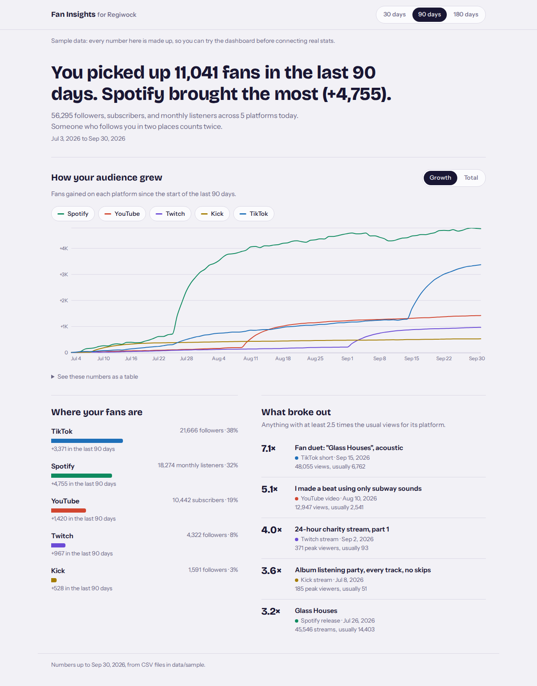
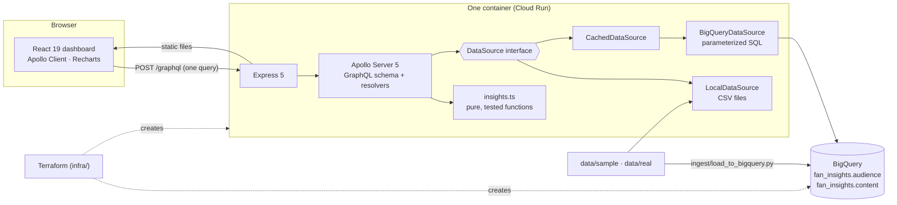

# Fan Insights Lite

[](https://github.com/ademco/creatordash/actions/workflows/ci.yml)

A fan-insights dashboard for an independent music artist and creator (Regiwock). It answers three questions in plain language: **how is my audience growing** across Spotify, YouTube, Twitch, Kick, and TikTok, **where are my fans**, and **which releases, videos, or streams broke out**.



<sup>Shown with the built-in sample data. Every number is made up. A dark theme follows the system setting: [dark screenshot](docs/screenshot-dark.png).</sup>

**Live demo:** not deployed yet. The infrastructure is ready; deploying takes one command after creating a Google Cloud project ([docs/DEPLOY.md](docs/DEPLOY.md)).

## What it does

- **A headline written from the data:** "You picked up 3,414 fans in the last 30 days. Most of them came from TikTok (+2,211)." It's honest about wording: it only says "most of them" when one platform really brought more than half.
- **Growth chart** with one line per platform. Switch between *Growth* (gain since the start of the window, so a 1.6K-follower Kick and a 21K TikTok share one readable scale) and *Total*, and show or hide platforms.
- **Where your fans are:** each platform's latest audience, its share, and its gain.
- **What broke out:** content with at least 2.5× the **median** views for its platform. The median, not the mean, so one viral post doesn't hide the next one (or itself).
- Windows of 30, 90, or 180 days, counted back from the newest date in the data, so old exports still work.

## Architecture



- **One GraphQL query** loads the whole page. The schema documents itself, with descriptions on every field, viewable in Apollo Sandbox at `/graphql`.
- **The insight rules are pure functions** in `api/src/insights.ts`. Data sources only filter by date, so the CSV and BigQuery versions behave identically.
- **In production**, the dashboard and API are one Express server in one container on Cloud Run (scale to zero). It reads BigQuery as a service account that can read one dataset and nothing else.

| Layer | Choice |
|---|---|
| Web | React 19, TypeScript 7, Vite 8, Apollo Client 4, Recharts 3 |
| API | Node 22, Express 5, Apollo Server 5, GraphQL |
| Data | CSV locally; BigQuery in the cloud (`@google-cloud/bigquery`) |
| Tests | Vitest (55 API + 10 web), Python `unittest` (7) |
| Infra | Docker (multi-stage), Terraform, Cloud Run v2, Artifact Registry, BigQuery |
| CI | GitHub Actions: typecheck, tests, build, `terraform validate`, Docker build |

## Run it

You need Node 22 (`nvm use` reads `.nvmrc`) and Python 3 for the ingest tests.

```bash
npm install
npm run dev          # dashboard: http://localhost:5173   API + Apollo Sandbox: http://localhost:4000/graphql
```

| Command | What it does |
|---|---|
| `npm run dev` | API and dashboard together, on the made-up sample data |
| `npm run dev:real` | Same, on your real numbers in `data/real/` ([docs/REAL_DATA.md](docs/REAL_DATA.md)) |
| `npm test` | All tests (TypeScript and Python) |
| `npm run typecheck` / `npm run build` | Type-check / production build |
| `npm run sample-data` | Regenerate the deterministic sample data |
| `npm run docker:build` then `npm run docker:run` | The production image at http://localhost:8080 |
| `scripts/deploy.sh PROJECT_ID` | Deploy to Google Cloud ([docs/DEPLOY.md](docs/DEPLOY.md)) |

## Repository tour

```
api/             GraphQL API (TypeScript): csv.ts, rows.ts, insights.ts, data sources, schema, resolvers
web/             React dashboard: App.tsx, components/, lib/ (headline wording, formatting, axis ticks)
data/sample/     Made-up data (180 days, 6 planned breakouts). See its README
data/templates/  Starting point for your real numbers
ingest/          Python: fan_data.py (check + upsert), load_to_bigquery.py
infra/           Terraform for Google Cloud
scripts/         Sample-data generator, deploy script
docs/            BUILD_LOG.md (how and why it was built), DEPLOY.md, REAL_DATA.md
```

## What I would build next

1. **Release impact.** For each release, the audience change on every platform in the 7 days after it, compared with the 7 days before. It answers "did that drop actually move anything?" and is a natural BigQuery window-function query.
2. **Daily refresh.** A scheduled Cloud Run job that pulls numbers from the platforms that have APIs (YouTube Analytics, Twitch) and `MERGE`s them into BigQuery, so the dashboard stays current without manual exports.
3. **A&R view.** Compare several artists' growth on one indexed scale (each artist = 100 at the start of the window). Before building it, I'd check exactly what the Spotify Web API currently allows, because access for new apps has been narrowed.
4. **Continuous deployment.** Deploy from GitHub Actions on merge to `main`, authenticated with Workload Identity Federation (no stored keys), with Terraform state in a shared GCS bucket.
5. **Generated GraphQL types.** Use GraphQL Code Generator so the API's resolvers and the web app's query types come from the schema instead of being written by hand.

## How it was built

Built in phases with an AI pair programmer (Claude Code), one pull request per phase. [docs/BUILD_LOG.md](docs/BUILD_LOG.md) records what was built in each phase, the decisions and trade-offs, and the questions I'd expect in an interview.
