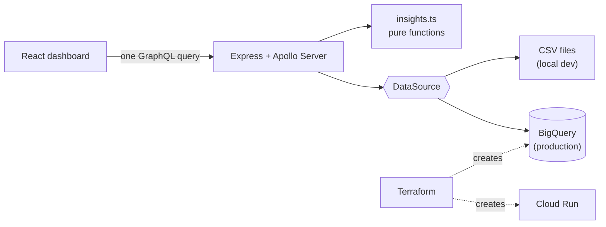

# Fan Insights

[](https://github.com/ademco/creatordash/actions/workflows/ci.yml)

I make music and stream as Regiwock. My audience is split across Spotify, YouTube, Twitch, Kick, and TikTok, and each platform has its own analytics page that answers a slightly different question. I wanted one page that tells me how I'm actually doing, so I built it.

**Live:** [fan-insights-gsv5wgokya-uc.a.run.app](https://fan-insights-gsv5wgokya-uc.a.run.app/?days=90). It runs on sample data: the numbers are made up, the pipeline is real. The first load can take a second or two because the service scales to zero.


[Dark mode](docs/screenshot-dark.png) follows your system setting.

## What it shows

The headline is a sentence written from the data, like "You picked up 11,041 fans in the last 90 days. Spotify brought the most (+4,755)." Under it: a growth chart with one line per platform, where each platform's audience is, and which posts broke out.

A post "broke out" if it got at least 2.5× the median views for its platform in that window. I use the median rather than the mean because a big hit inflates the mean and can hide itself, or the next hit. Platforms with fewer than three posts are skipped, since a median of two isn't worth much.

Windows (30, 90, 180 days) count back from the newest date in the data, not from today, so an old export still shows a full picture.

## How it works



The page makes one GraphQL query. The API keeps the rules in `api/src/insights.ts` as pure, tested functions, and reads rows through a small `DataSource` interface: CSV files on my laptop, BigQuery in production. Both return the same shapes, so the rules can't tell them apart.

In production it's a single container on Cloud Run that serves both the API and the built React app. It reads BigQuery as a service account that can see one dataset and nothing else. Everything in Google Cloud is defined in Terraform under `infra/`, and GitHub Actions runs typecheck, tests, build, `terraform validate`, and a Docker build on every push.

Stack: React 19, TypeScript, Vite, Apollo Client and Server, Recharts, Express 5, BigQuery, Terraform, Docker, Cloud Run, Vitest.

## Run it

Needs Node 22 (`nvm use`).

```bash
npm install
npm run dev
```

The dashboard is at http://localhost:5173 and Apollo Sandbox at http://localhost:4000/graphql. Other commands:

```bash
npm test                                   # TypeScript and Python tests
npm run typecheck && npm run build
npm run dev:real                           # use your own numbers from data/real/
npm run docker:build && npm run docker:run # production image on :8080
scripts/deploy.sh PROJECT_ID               # deploy to Google Cloud
npm run load-bq -- PROJECT_ID              # load CSVs into BigQuery
```

[docs/REAL_DATA.md](docs/REAL_DATA.md) covers the CSV format and where to export each platform's numbers. [docs/DEPLOY.md](docs/DEPLOY.md) covers Google Cloud from an empty account.

## One bug worth mentioning

After the first deploy the live site showed zeros even though BigQuery had all the rows. The cause: the BigQuery Node client silently drops a plain string passed as a `DATE` parameter, so `WHERE date >= @since` became `date >= NULL` and matched nothing. No error, just an empty page. The tests missed it because they used a fake query runner. The fix casts in SQL, and a new test runs the client library's real parameter code. The full story is in the [build log](docs/BUILD_LOG.md#fix-live-dashboard-empty-after-loading-bigquery).

## What I'd build next

- **Release impact.** For each release, the audience change in the week after versus the week before. It answers "did that drop move anything?" and is a natural window-function query in BigQuery.
- **Daily refresh.** A scheduled job that pulls from the platforms with APIs (YouTube, Twitch) and merges into BigQuery, so I stop exporting CSVs by hand.
- **Deploy on merge.** GitHub Actions deploying with Workload Identity Federation instead of stored keys, and Terraform state in a shared bucket.

## How I built it

I built this with Claude Code as a pair programmer, one phase and one pull request at a time, against a written spec ([CLAUDE.md](CLAUDE.md)). I reviewed each change before merging it, and kept a [build log](docs/BUILD_LOG.md) of what each phase did and why.
