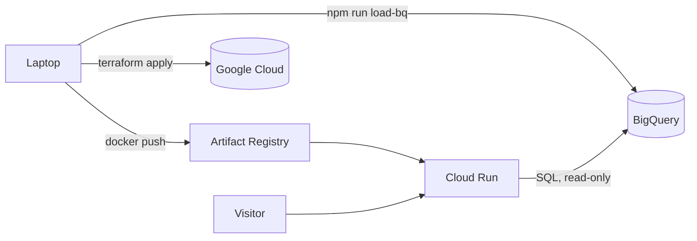

# Deploying to Google Cloud

This puts the dashboard on a public URL with its data in BigQuery. Terraform and `scripts/deploy.sh` do almost all of it. The only manual parts are creating the project, linking billing, and logging in.

At portfolio traffic it costs nothing, because everything here sits inside a free tier: Cloud Run scales to zero, the BigQuery tables are a few KB, and old images are cleaned up automatically. You still need a billing account, so set the budget alert in step 3 anyway.



## 1. Install the tools

```bash
brew install --cask google-cloud-sdk   # gcloud and bq
brew install terraform
brew install --cask docker             # open Docker Desktop once so the engine starts
```

## 2. Create a project and link billing

Create a project at https://console.cloud.google.com/projectcreate. Google appends a number to make the ID unique, like `fan-insights-482913`. Every command below needs that ID.

Then link it to a billing account at https://console.cloud.google.com/billing.

## 3. Set a budget alert

At https://console.cloud.google.com/billing/budgets, create a $5 budget for the project with alerts at 50%, 90%, and 100%.

A budget only sends email; it doesn't stop spending. With scale-to-zero and at most two instances a surprise bill is unlikely, but this is how you'd hear about one.

## 4. Log in

```bash
gcloud auth login
gcloud auth application-default login     # Terraform uses this one
gcloud config set project YOUR_PROJECT_ID
```

## 5. Deploy

```bash
scripts/deploy.sh YOUR_PROJECT_ID
```

It runs `terraform init`, then creates the APIs and the image registry, builds and pushes a `linux/amd64` image, and creates the rest: BigQuery dataset and tables, a service account, and the Cloud Run service. Terraform stops twice to show its plan. Read it, then type `yes`. The first run takes a few minutes, mostly enabling APIs, and prints the URL at the end.

## 6. Load data

```bash
npm run load-bq -- YOUR_PROJECT_ID              # sample data
npm run load-bq -- YOUR_PROJECT_ID data/real    # your own numbers
```

This checks and cleans both CSVs with the API's own parser, loads them, compares row counts, and waits until the live page shows the numbers. It needs only `gcloud`, `bq`, and Node. (`ingest/load_to_bigquery.py` does the same in Python.)

Once you load real numbers, turn off the sample-data label:

```bash
SAMPLE_DATA=false scripts/deploy.sh YOUR_PROJECT_ID
```

## Updating

Commit, then run `scripts/deploy.sh YOUR_PROJECT_ID` again. Images are tagged with the git commit, so you can always tell which code is live. A `-dirty` suffix means the image was built with uncommitted changes. The API caches answers for 5 minutes, so new data can take that long to appear.

## Tearing it down

```bash
terraform -chdir=infra destroy -var project_id=YOUR_PROJECT_ID
```

That deletes everything Terraform created, data included. Deleting the whole project in the console also works.

## Terraform, briefly

`infra/*.tf` describes what should exist; Terraform works out how to get there. `terraform plan` shows what it would change (`+` create, `~` update, `-` destroy) and changes nothing. `terraform apply` shows the same plan and acts only after you type `yes`. An unexpected `-` is the thing to catch.

State (`infra/terraform.tfstate`) is Terraform's record of which real resources it manages. It's git-ignored because it can hold sensitive values. Lose it and Terraform forgets what it made, though the resources keep running. A team would keep it in a Cloud Storage bucket with locking.

The deploy script uses `-target` once, on purpose: Cloud Run needs an image, and the image needs a registry, so the registry is created first.

## When something breaks

| What you see | What to do |
|---|---|
| `Error 403: ... API has not been used in project` | An API is still turning on. Wait a minute and run the script again. |
| "Couldn't load your numbers" | Check Cloud Run → fan-insights → Logs. `Access Denied` means permissions are still propagating; wait a minute. `Not found: Table` means step 6 hasn't run. |
| "No numbers yet" | The tables are empty. Run step 6. |
| `exec format error` in the logs | The image was built for ARM. Use the script, which always builds `linux/amd64`. |
| Can't add `allUsers` | Some Google Workspace organizations block public services. A personal project works. |
