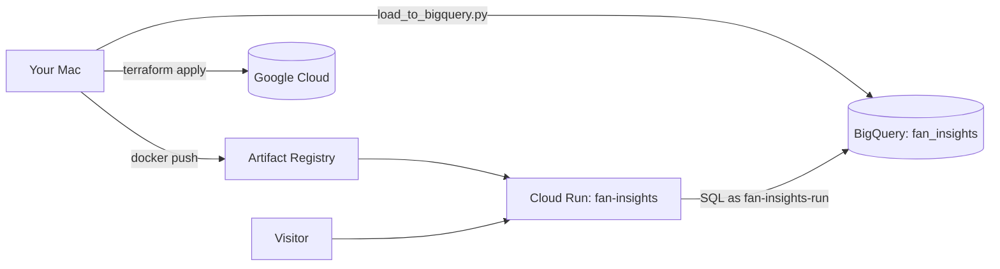

# Deploying to Google Cloud

This puts the dashboard on a public URL, with the data in BigQuery. Everything except steps 2 and 3 (and the gcloud login prompts in step 4) is automated by Terraform and `scripts/deploy.sh`.

**What it costs:** at portfolio traffic it should be $0, but it needs a billing account. Everything used here has a monthly free tier:
- Cloud Run scales to zero, so you pay nothing while nobody is looking.
- BigQuery's first 1 TB of queries per month is free; these tables are a few KB.
- Artifact Registry's first 0.5 GB of storage is free, and old images are cleaned up automatically.

The budget alert in step 3 tells you if that ever stops being true.



## 1. Install the tools (once)

```bash
brew install --cask google-cloud-sdk   # gcloud
brew install terraform                 # or: brew tap hashicorp/tap && brew install hashicorp/tap/terraform
brew install --cask docker             # Docker Desktop; open it once so the engine starts
python3 -m pip install -r ingest/requirements.txt
```

## 2. Create a project and link billing (once, in the browser)

1. Go to https://console.cloud.google.com/projectcreate and create a project, for example `fan-insights`. Google adds a number to make the ID unique (for example `fan-insights-482913`). **Copy the project ID**; every command below needs it.
2. Go to https://console.cloud.google.com/billing and link the project to a billing account. New accounts usually get free trial credit.

## 3. Set a budget alert (once, before deploying anything)

1. Go to https://console.cloud.google.com/billing/budgets and click **Create budget**.
2. Scope: your fan-insights project. Amount: **$5**.
3. Alert thresholds: 50%, 90%, and 100%. Keep "Email alerts to billing admins" on.

A budget only *alerts*; it doesn't stop spending. With scale-to-zero and `max_instances = 2`, a surprise bill is very unlikely, but this is how you'd find out.

## 4. Log in (once per machine)

```bash
gcloud auth login                         # for gcloud and docker push
gcloud auth application-default login     # for Terraform and the Python loader
gcloud config set project YOUR_PROJECT_ID
```

## 5. Deploy

```bash
scripts/deploy.sh YOUR_PROJECT_ID
```

The script will:
1. `terraform init`: downloads the Google provider.
2. Turn on the APIs and create the image registry. Terraform shows a plan; type `yes`.
3. Build the image for `linux/amd64` and push it.
4. Create everything else: the BigQuery dataset and tables, the service account and its two permissions, and the Cloud Run service. Again it shows a plan; type `yes`.

It prints the URL at the end. The first deploy takes a few minutes, mostly enabling APIs.

## 6. Load data into BigQuery

```bash
python3 ingest/load_to_bigquery.py --project YOUR_PROJECT_ID --data data/sample
```

No working Python? This does the same with only `gcloud` and `bq`, then counts the rows and waits until the live page shows the numbers:

```bash
npm run load-bq -- YOUR_PROJECT_ID              # sample data
npm run load-bq -- YOUR_PROJECT_ID data/real    # your real numbers
```

Refresh the URL. The page now reads from BigQuery: the footer says "from BigQuery dataset ...". To show your real numbers instead, load them and redeploy with the sample-data note turned off:

```bash
python3 ingest/load_to_bigquery.py --project YOUR_PROJECT_ID --data data/real
SAMPLE_DATA=false scripts/deploy.sh YOUR_PROJECT_ID
```

## Updating

Change code, commit, run `scripts/deploy.sh YOUR_PROJECT_ID` again. Each image is tagged with its git commit, so you can always tell which code is live. To refresh the data, re-run the loader; the API caches answers for 5 minutes.

## Tearing it all down

```bash
terraform -chdir=infra destroy -var project_id=YOUR_PROJECT_ID
```

This deletes everything Terraform created, including the BigQuery data. Or delete the whole project in the console.

## Terraform in five minutes

- **Declarative:** `infra/*.tf` describes what should exist, not the steps to create it. Terraform works out the steps.
- **`terraform plan`** compares the `.tf` files with what exists and prints what it *would* change: `+` create, `~` update, `-` destroy. It changes nothing, so it's always safe to run.
- **`terraform apply`** makes the same plan, shows it, and only acts after you type `yes`. Read the plan every time. A surprise `-` (destroy) is the thing to catch.
- **State** (`infra/terraform.tfstate`) is Terraform's record of which real resources it manages and their IDs. It's how Terraform knows that "the BigQuery dataset" in the code is *that* dataset in the cloud. It's git-ignored because it can contain sensitive values. Lose it and Terraform forgets what it created (the resources keep running). A team would keep state in a Cloud Storage bucket so everyone shares one copy, with locking so two applies can't run at once.
- **Why `-target` in the deploy script:** Cloud Run can't be created until an image exists, and the image can't be pushed until the registry exists. Targeting the registry first breaks that loop. It's the one place `-target` is normal; day to day you apply everything.

## If something goes wrong

| Symptom | Likely cause and fix |
|---|---|
| `Error 403: ... API has not been used in project` | An API is still switching on. Wait a minute and re-run the script. |
| Page says "Couldn't load your numbers" | Open Cloud Run → fan-insights → Logs. `Access Denied` on BigQuery means the IAM grants are still propagating (wait a minute). `Not found: Table` means step 6 hasn't run yet. |
| Page shows "No numbers yet" | The tables are empty. Run step 6. |
| `exec format error` in the Cloud Run logs | The image was built for ARM. The script always passes `--platform linux/amd64`; don't build it without that. |
| `allUsers` can't be added | Some Google Workspace organizations block public services. A personal project (no organization) allows it. |
